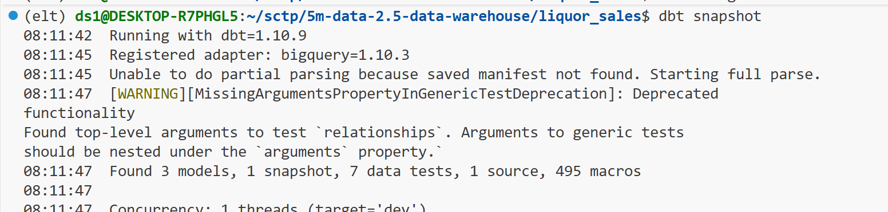
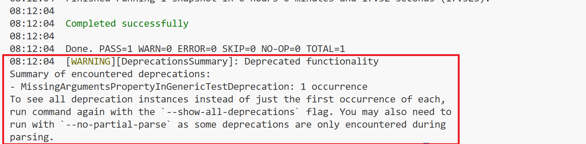
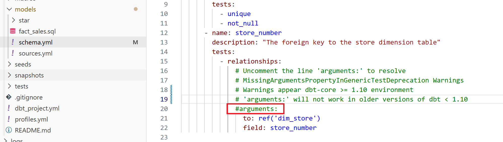
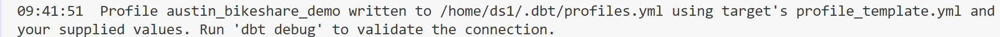

# Lesson

## Brief

### Preparation

- Create the conda environment based on the `elt-environment.yml` file. We will also be using google cloud (for which the account was created in the previous unit) in this lesson.

- Please refer to the [Environment Folder](https://github.com/su-ntu-ctp/5m-data-2.1-intro-big-data-eng/tree/main/environments) for the environment files. Please refer to the [installation.md](https://github.com/su-ntu-ctp/5m-data-2.1-intro-big-data-eng/blob/main/installation.md) for setup details.

### Lesson Overview

This lesson introduces data warehouse, ingestion model and dimensional modeling. It also contains hands-on _Transform_ part of ELT (dimensional modeling) with `dbt` and `BigQuery`.

---

## Part 1 - Data Warehouse and Dimensional Modeling

Conceptual knowledge, refer to slides.

---

## Part 2 - Hands-on with dbt and BigQuery


### Designing and Implementing Star Schema and Snowflake Schema for Liquor Sales Data

Please refer to [README.md](liquor_sales/README.md) in the `liquor_sales` folder to perform the necessary setup to run this liquor sales project.

In this section, we will be using the `liquor_sales` dataset. This dataset contains liquor sales data from Iowa, and available at [BigQuery Public](https://console.cloud.google.com/bigquery?p=bigquery-public-data&d=iowa_liquor_sales&page=dataset). The dbt project is located at `liquor_sales` directory. This is a **fully completed** dbt project that has been pre-populated for you. Skim through the `.yml` and `.sql` files in the `snapshots` and `models` directory.

The source is defined and configured in `models/sources.yml`. It refers to the `bigquery-public-data.iowa_liquor_sales.sales` table.

A star schema with a `sales` fact table, a `store` dimension table and an incomplete `item` dimension table have been implemented. The `schema.yml` files define the schemas for the fact and dimension tables. They contain the name, description and tests for the primary keys of the tables.

#### Snapshots

A snapshot is a table that contains the current state of a source table. Snapshots enable "looking back in time" at previous data states in their mutable tables. While some source data systems are built in a way that makes accessing historical data possible, this is not always the case. Snapshots implement _type-2 Slowly Changing Dimensions_ over mutable source tables. These Slowly Changing Dimensions (or SCDs) identify how a row in a table changes over time.

There is a snapshot for the `store` dimension table defined in `snapshots/store_snapshot.sql`.

#### Models

The `fact_sales` model is defined in `models/fact_sales.sql`. It is a view that selects from the source table.

The dimension models are nested in a `star` subdirectory. Refer to the `dbt_project.yml` file for the configuration. It uses a custom schema and materialized table.

The `dim_store` model is defined in `dim_store.sql`. It selects from the `store_snapshot` table. The `dim_item` model is defined in `dim_item.sql`. Currently it selects from the source table directly.

Before we start running dbt command, make sure that:
- You have open a terminal.
- Navigate to the `liquor_sales` folder by running `cd liquor_sales`
- Make you are in the `elt` environment by running `conda activate elt`
- Make sure the Bigquery connection is successful by running `dbt debug`

Since this dbt project have snapshots, we need to run the following command first:

```bash
dbt snapshot
```

Build the models with the following command:

```bash
dbt run
```

If you encounter issues with the above, the following commands may help. Run the below before running `dbt run`:

```bash
dbt clean
dbt debug
```

> ⚠️ **Warning!**
>
> **You may encounter warning message as follows:**
> 
>
> **or similar message as below:**
> 
>
> **To resolve this warning you need to uncomment `arguments` at the `schema.yml` for `fact_sales.sql`. This is under the `models` folder.** 
>
> 
>
> Reference: https://docs.getdbt.com/reference/deprecations#missingargumentspropertyingenerictestdeprecation


#### Tests

Tests are defined in `schema.yml` files. They are used to validate the data in the tables. For example, the `dim_store` table has a test that checks if the `store_number` is unique and not null.

Run the tests with the following command:

```bash
dbt test
```

Observe the test results. There should be 1 failing test for the `dim_item` table.

#### Practice

> 1. Implement a snapshot for the `item` dimension table. Then update the `dim_item` model to use the snapshot.
> 2. Add a test for the `item_number` foreign key in the `fact_sales` table. The test should check if the `item_number` exists in the `dim_item` table.
> 3. Run the tests again and make sure they pass.


### Designing and Implementing Star Schema for Austin Bikeshare Data from Scratch

We will be using the `austin_bikeshare` dataset. This data contains the number of hires of bicycles from Austin Bikes. Data includes start and stop timestamps, station names and ride duration.

It is available at [BigQuery Public](https://console.cloud.google.com/bigquery?ws=!1m4!1m3!3m2!1sbigquery-public-data!2saustin_bikeshare).

We will create a dbt project from scratch and implement a star schema for the data warehouse.


>⚠️ Warning! Make sure that  we are under the folder `5m-data-2.5-data-warehouse`. Many learners make the mistake of running `dbt init austin_bikeshare_demo` inside the `liquor_sales` project folder. Please do not do this! Each dbt project should be within its own project folder. So please return to the root folder `5m-data-2.5-data-warehouse` before running `dbt init austin_bikeshare_demo`.

> Make sure you have activate the `elt` environment using `conda activate elt`

#### Setting up a dbt project from scratch
1. Run `dbt init austin_bikeshare_demo` to create a new dbt project.
    * Choose `bigquery` as the desired database to use
    * Choose `oauth` as the desired authentication method
    * Enter your GCP project ID when asked
    * Enter `austin_bikeshare_demo` as the name of your dbt dataset
    * For threads and job_execution_timeout_seconds, use the default
    * For desired location, choose US (because the public austin_bikeshare dataset resides in US)

Once the initialization is completed, you should have see the following message:


#### Setting up profiles.yml
Click on the `profiles.yml`, alternatively the `profiles.yml` is located at home folder:
- For `WSL` user, it is located at the WSL folder (`/home/<wsl_username>/.dbt/profiles.yml`)
- For `Mac` user, it is located at the home folder (`~/.dbt/profiles.yml` or `Users/<mac_username>/.dbt/profiles.yml`)

Copy the profiles under `austin_bikeshare_demo` if you have more than one profiles.
Under `austin_bikeshare_demo` folder, create a new file called `profiles.yml` and paste the profile information and save the `profiles.yml`.

Finally, do a `dbt debug` to confirm profiles is good.

#### Design dbt models
For 2. and 3. below, the learner is advised to go through the liquor_sales DBT project first before returning to complete 2. and 3. below.

2. Add a fact and dimension model.
3. Add tests.


#### Snowflake Schema (Extra)

In a snowflake schema, each dimension can have one or more dimensions. For example, the `item` dimension table can be further normalized into `item`, `category` and `vendor` dimension tables. The `item` dimension table will contain the `category` and `vendor_number` as foreign keys.

For the practices below, create a subdirectory under `models` called `snowflake`.

> 1. Normalize `dim_item` table into `dim_item`, `dim_category` and `dim_vendor` dimension tables.
> 2. Normalize `dim_store` table into `dim_store` and `dim_county` dimension tables.
> 3. Add `schema.yml` with tests for the primary and foreign keys.
> 4. Add a new custom `snowflake` schema with materialized tables in `dbt_project.yml`.
> 5. Run the dbt commands to build the models and run the tests.


## Additional dbt Command (Self Study)

- Use `dbt build` can perform dbt run and dbt test concurrently. [Reference](https://docs.getdbt.com/reference/commands/build)
- Use `dbt docs generate` will build a set of documentation based on the description you put in in the schema. [Reference](https://docs.getdbt.com/reference/commands/cmd-docs#dbt-docs-generate)
- Use `dbt docs serve` to run an internal website that contains all your documents. [Reference](https://docs.getdbt.com/reference/commands/cmd-docs#dbt-docs-serve)

Please refer to [dbt command reference](https://docs.getdbt.com/reference/dbt-commands) for further information.